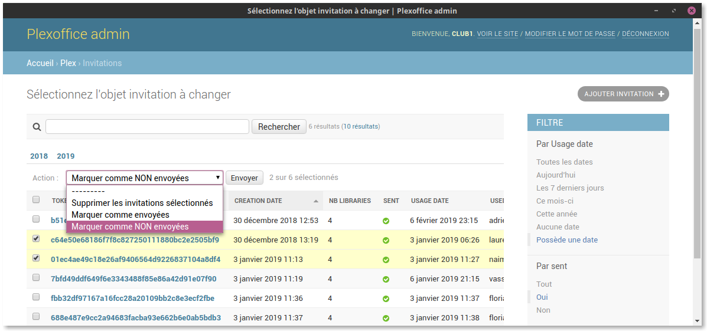

# PlexOffice

A micro backoffice to manage some Plex stuffs, extensively using Django admin.



## Getting started

### Install

```bash

# create virtualenv in the env dir then activate it
virtualenv env
. env/bin/activate

# install dependencies
pip install -r requirements.txt

# copy sample settings file and edit credentials
cp plexoffice/settings.sample.py plexoffice/settings.py
nano plexoffice/settings.py

# collect static files (not needed for development)
./manage.py collectstatic
```

### Run

    ./manage.py runserver

## Update

_`// TODO: write this section`_

## Deployment

### With Apache2

#### Install mod_wsgi

```bash
# Debian
sudo apt-get install libapache2-mod-wsgi
sudo systemctl restart apache2
```

#### Exemple site vhost

```apacheconf
<VirtualHost *:80>

    # ...
    # Your classic vhost conf
    # ...

    ##################################
    ### Conf for Django Plexoffice ###
    ##################################

    # Wsgi module conf
    <IfModule mod_wsgi.c>
        WSGIDaemonProcess plexoffice python-home={virtual-env-dir} python-path={plexoffice-root-dir} user={user-name} group={group-name}
        WSGIProcessGroup plexoffice
        WSGIScriptAlias {url-path} {plexoffice-root-dir}/plexoffice/wsgi.py process-group=plexoffice
    </IfModule>

    # Authorize access to static files' dir
    Alias {url-path}/static/ {plexoffice-root-dir}/collect/
    <Directory {plexoffice-root-dir}/collect>
        Require all granted
    </Directory>

    # Authorize acces to django launch script
    <Directory {plexoffice-root-dir}/>
        <Files wsgi.py>
            Require all granted
        </Files>
    </Directory>
</VirtualHost>
```